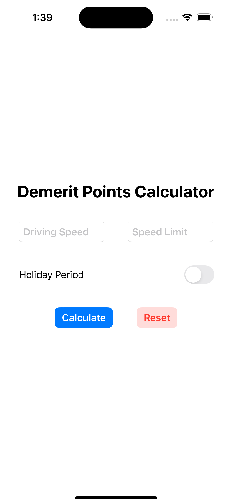
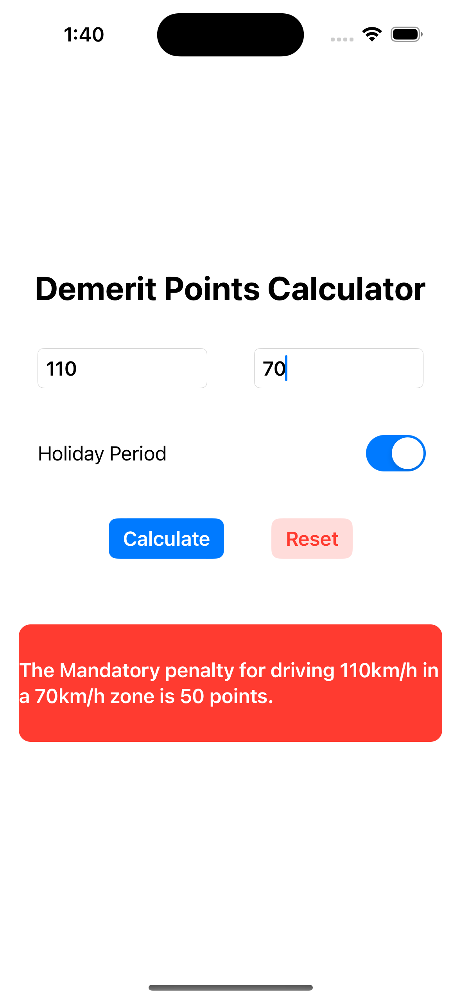
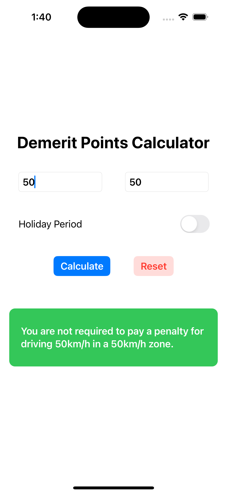

# Demerit Points Calculator (SwiftUI)

Creating a demerit points calculator using SwiftUI. The code for this app is based on my previous Python Flask app [Demerit Points Calculator](https://github.com/fstevens30/Demerit-Points-Calculator).

## Screenshots

<table>
    <tr>
        <td>Main Screen</td>
        <td>Mandatory Penatly</td>
        <td>Discretional Penalty</td>
        <td>No Penalty</td>
    </tr>
    <tr>
        <td></td>
        <td></td>
        <td></td>
        <td></td>
    </tr>
</table>
