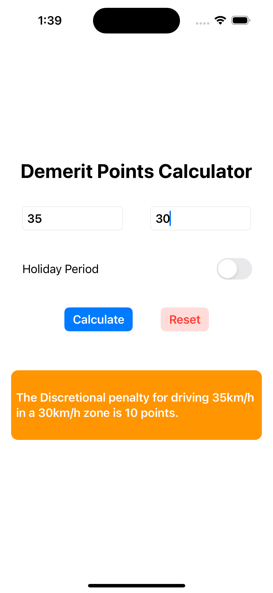

# Demerit Points Calculator (SwiftUI)

Creating a demerit points calculator using SwiftUI. The code for this app is based on my previous Python Flask app [Demerit Points Calculator](https://github.com/fstevens30/Demerit-Points-Calculator).

## Screenshots

